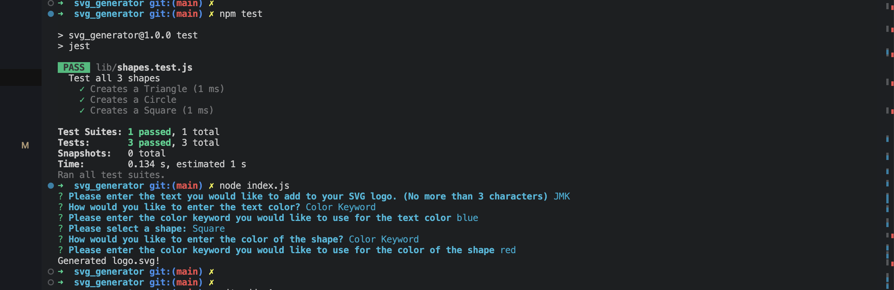

# SVG Generator
  
## Description
  
This nodejs app uses inquirer to prompt the end user a list of questions to create a svg file.  We are using object oriented programming to handle all the redundant code for the different shapes.  We also used Jest to run tests on the different shapes to ensure we are returning the expected data.

## Installation

npm i inquirer@8.2.4

## Usage

To run this app you type node index.js on the command line.

 ## Questions

Link to my github profile: [jarrodkrauszer](https://github.com/jarrodkrauszer)

Here is a link to the project: [SVG Generator](https://github.com/jarrodkrauszer/svg_generator)
  
If you have any further questions you can email me at: [jarrod.krauszer@gmail.com](jarrod.krauszer@gmail.com)

Here is a link to the demo video: [SVG Generator Walkthrough Video](https://youtu.be/5iZP3naqkj8)
